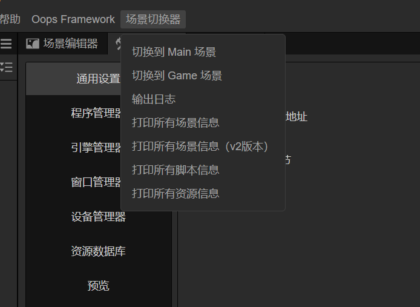
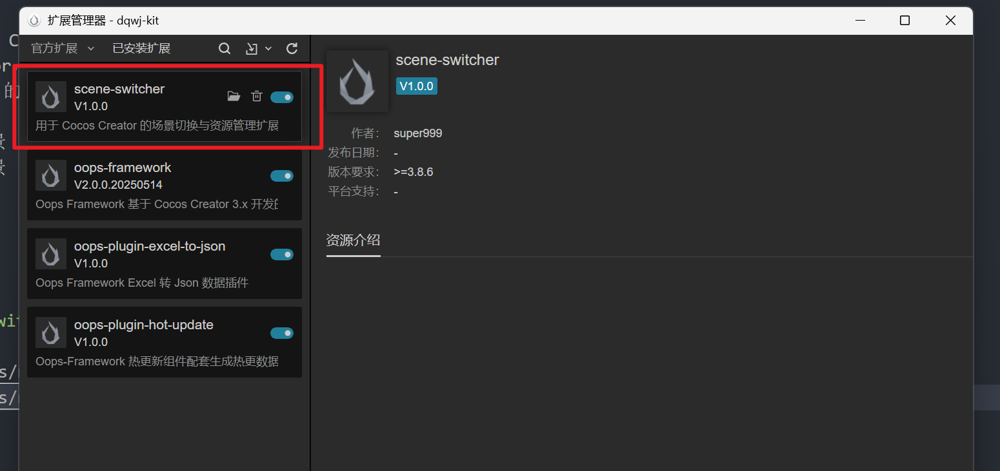
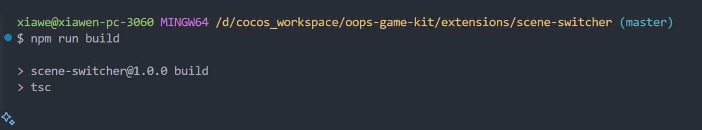

# Scene Switcher Extension (Cocos Creator 3.8.6)

A scene switching and asset management extension for Cocos Creator 3.8.6. Supports one-click scene switching, printing scene and asset information, and improves development efficiency.

## Features

- One-click switch to Main or Game scene
- Print all scene information
- Print all asset information
- Support for menu or message invocation

## Installation & Build

```bash
# Install dependencies
npm install
# Build TypeScript code
npm run build
```

After building, the extension will be output to the `dist/` directory automatically.

## Usage

1. Place this extension folder into the `extensions/` directory of your Cocos Creator project.
2. Start Cocos Creator, go to Extensions -> Extension Manager -> Installed Extensions, and enable the Scene Switcher extension.
3. In the Cocos Creator menu bar, select `Scene Switcher` to access the following features:
   - Print all scenes
   - Switch to Main scene
   - Switch to Game scene
   - Print all assets

## Extension Menu Screenshots

> Screenshots:

<br/>
<br/>
<br/>

## Directory Structure

```
extensions/scene-switcher/
├── dist/                # Build output directory
├── source/              # TypeScript source code
│   ├── main.ts          # Extension entry
│   ├── scene.ts         # Scene-related methods
│   ├── asset.ts         # Asset-related methods
│   └── ...
├── package.json         # Extension config
├── README.md            # Documentation
└── ...
```

## FAQ

- If you encounter type errors, please ensure the `@cocos/creator-types` dependency version matches your Cocos Creator version.
- If you cannot switch scenes, please check that the scene names match your actual resources.

## Author Info

- Author: super999
- QQ: 281656070
- WeChat: super999t
- Email: sup9@qq.com
- WeChat QR Code:

  

## GitHub Repository

Project repository: [https://github.com/super999/scene-switcher](https://github.com/super999/scene-switcher)

---

## License

MIT License

## Changelog

### v1.0.0

- Initial release with scene switching and asset management features.
- Added menu options for printing scene and asset information.
- Provided support for both menu and message invocation.
- Included documentation and screenshots.