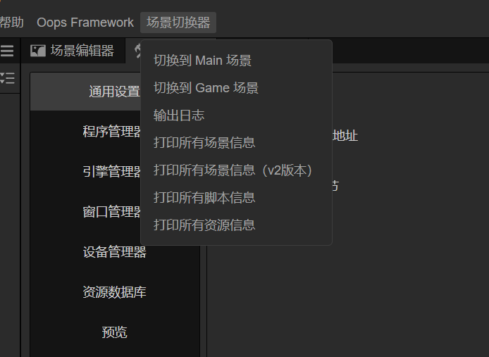
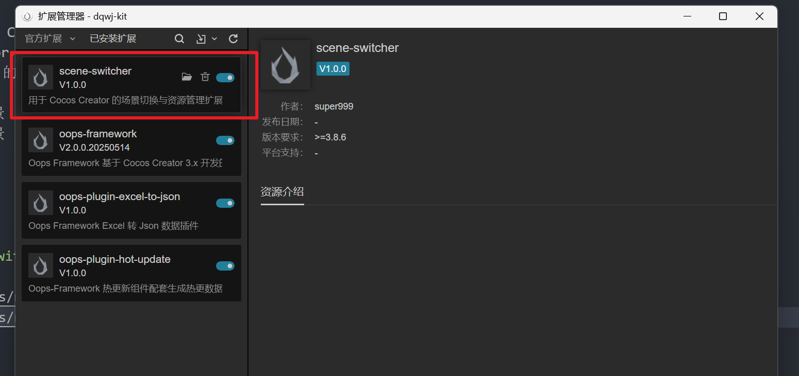
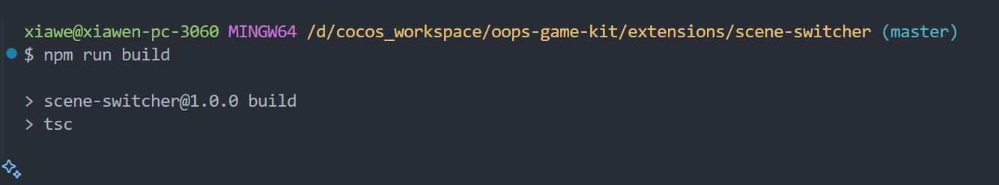

# Scene Switcher 扩展插件（Cocos Creator 3.8.6）

一个用于 Cocos Creator 3.8.6 的场景切换与资源管理扩展插件，支持一键切换场景、打印场景和资源信息，提升开发效率。

## 功能简介

- 一键切换到 Main 或 Game 场景
- 打印所有场景信息
- 打印所有资源信息
- 支持通过菜单或消息调用

## 安装与构建

```bash
# 安装依赖
npm install
# 构建 TypeScript 代码
npm run build
```

构建完成后，扩展会自动输出到 `dist/` 目录。

## 使用方法

1. 将本插件文件夹放入 Cocos Creator 的 `extensions/` 目录下。
2. 启动 Cocos Creator，找到扩展-> 扩展管理器-> 已安装扩展， 启用 Scene Switcher 扩展。
3. 在 Cocos Creator 的菜单栏中，选择 `场景切换器（Scene Switcher）`，可以看到以下功能选项：
   - 打印所有场景
   - 切换到 Main 场景
   - 切换到 Game 场景
   - 打印所有资源


## 插件菜单截图

> 截图展示：


<br/>
<br/>
<br/>

## 目录结构

```
extensions/scene-switcher/
├── dist/                # 构建输出目录
├── source/              # TypeScript 源码目录
│   ├── main.ts          # 插件主入口
│   ├── scene.ts         # 场景相关方法
│   ├── asset.ts         # 资源相关方法
│   └── ...
├── package.json         # 插件配置
├── README.md            # 插件说明文档
└── ...
```

## 常见问题

- 如遇到类型报错，请确保依赖的 `@cocos/creator-types` 版本与 Cocos Creator 保持一致。
- 若无法切换场景，请确认场景名称与实际资源一致。

## 作者信息

- 作者：super999
- QQ：281656070
- 微信号：super999t
- 邮箱：sup9@qq.com
- 微信二维码：

  

---

## 许可协议

MIT License
